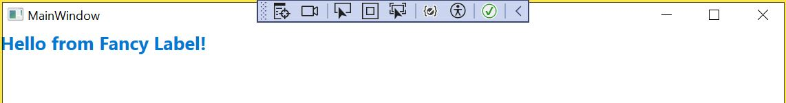

1. Created Demo Wpf Application .NET 8.0
2. Created Class Library Project
2.1 Edited .csproj to include:

    ```<UseWPF>true</UseWPF>```
1. App look like this with Fancy Label user control

1. After adding custom button

1. gamma
1. delta